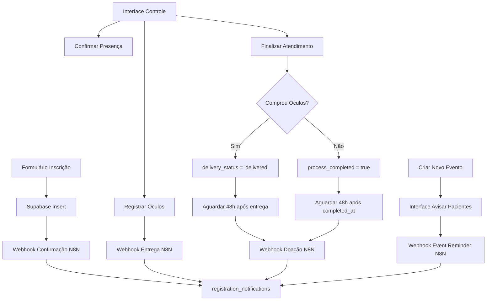

# Design Document

## Overview

O sistema implementa um controle completo de eventos com três fluxos automatizados via N8N:
1. **Confirmação de Inscrição**: Webhook imediato após inscrição
2. **Notificação de Entrega**: Webhook quando óculos são agendados para entrega
3. **Campanha de Doação**: Webhook quando processo é finalizado sem compra

A arquitetura segue o padrão existente do sistema, estendendo a tabela `registrations` e criando uma nova interface de controle em `/admin-v2/event-control`.

## Architecture



### Fluxo de Dados

1. **Inscrição**: Frontend → Supabase → Webhook Confirmação → N8N → WhatsApp
2. **Controle**: Interface Admin → Supabase Updates → Triggers Webhooks → N8N
3. **Auditoria**: Todas ações → registration_notifications table

## Components and Interfaces

### 1. Database Schema Extensions

```sql
-- Extensão da tabela registrations
ALTER TABLE registrations
ADD COLUMN attendance_confirmed BOOLEAN DEFAULT FALSE,
ADD COLUMN attendance_confirmed_at TIMESTAMP,
ADD COLUMN purchased_glasses BOOLEAN DEFAULT FALSE,
ADD COLUMN glasses_purchase_amount DECIMAL(10,2),
ADD COLUMN delivery_date TIMESTAMP,
ADD COLUMN delivery_status VARCHAR(20) DEFAULT 'pending',
ADD COLUMN process_completed BOOLEAN DEFAULT FALSE,
ADD COLUMN completed_at TIMESTAMP,
ADD COLUMN attended_by VARCHAR(255);
```

**delivery_status enum values:**
- `pending`: Aguardando agendamento
- `scheduled`: Data de entrega definida
- `ready`: Pronto para retirada
- `delivered`: Entregue
- `cancelled`: Cancelado

### 2. Frontend Components

#### EventControlPage (`/admin-v2/event-control`)
```typescript
interface EventControlProps {
  selectedDate: Date;
  eventId: string;
}

interface RegistrationStatus {
  id: string;
  patient_name: string;
  phone: string;
  cpf: string;
  attendance_confirmed: boolean;
  purchased_glasses: boolean;
  glasses_purchase_amount?: number;
  delivery_date?: Date;
  process_completed: boolean;
  attended_by?: string;
}
```

#### Components Structure:
- `EventSelector`: Dropdown para selecionar evento/data
- `RegistrationList`: Lista paginada de inscritos
- `RegistrationCard`: Card individual com ações
- `GlassesModal`: Modal para registrar compra de óculos
- `StatusBadge`: Badge visual para status
- `FilterBar`: Filtros e busca

### 3. Webhook Service

```typescript
interface WebhookService {
  sendConfirmationWebhook(registrationId: string): Promise<void>;
  sendDeliveryWebhook(registrationId: string, deliveryDate: Date): Promise<void>;
  sendDonationWebhook(registrationId: string): Promise<void>;
}

interface WebhookPayload {
  registration_id: string;
  timestamp: string;
  // Campos específicos por tipo de webhook
}
```

### 4. API Endpoints

```typescript
// Novos endpoints necessários
GET /api/admin/events/{eventId}/registrations
PUT /api/admin/registrations/{id}/confirm-attendance
PUT /api/admin/registrations/{id}/register-glasses
PUT /api/admin/registrations/{id}/complete-process
GET /api/admin/events/{eventId}/summary

// Endpoints para agendamento de webhooks
POST /api/admin/webhooks/schedule-donation
GET /api/admin/webhooks/scheduled
POST /api/admin/webhooks/execute-scheduled

// Endpoints para avisos de eventos (funcionalidade futura)
POST /api/admin/events/{eventId}/notify-previous-patients
GET /api/admin/patients/previous-participants
```

## Data Models

### Extended Registration Model
```typescript
interface Registration {
  // Campos existentes
  id: string;
  patient_id: string;
  event_date_id: string;
  status: string;
  created_at: Date;
  updated_at: Date;
  delivery_date?: Date;
  delivery_status: string;

  // Novos campos
  attendance_confirmed: boolean;
  attendance_confirmed_at?: Date;
  purchased_glasses: boolean;
  glasses_purchase_amount?: number;
  process_completed: boolean;
  completed_at?: Date;
  attended_by?: string;
}
```

### Webhook Notification Model
```typescript
interface WebhookNotification {
  id: string;
  registration_id: string;
  notification_type: 'confirmation' | 'delivery' | 'donation' | 'event_reminder';
  sent_at: Date;
  status: 'sent' | 'failed' | 'pending' | 'scheduled';
  message_content?: string;
  phone_number?: string;
  created_at: Date;
  error_details?: string;
}
```

### Scheduled Webhook Model (Para sistema de agendamento)
```typescript
interface ScheduledWebhook {
  id: string;
  registration_id: string;
  webhook_type: 'donation' | 'event_reminder';
  scheduled_for: Date;
  executed_at?: Date;
  status: 'scheduled' | 'executed' | 'failed' | 'cancelled';
  created_at: Date;
}
```

## Error Handling

### Webhook Failures
- **Non-blocking**: Falhas de webhook não impedem operações principais
- **Retry Logic**: Implementar retry com backoff exponencial
- **Logging**: Registrar todos os erros na tabela `registration_notifications`
- **Monitoring**: Dashboard para monitorar taxa de sucesso dos webhooks

### Validation Errors
- **Frontend**: Validação imediata com feedback visual
- **Backend**: Validação dupla com mensagens claras
- **Database**: Constraints para garantir integridade

### Error Recovery
```typescript
interface ErrorRecovery {
  retryFailedWebhooks(): Promise<void>;
  validateDataIntegrity(): Promise<ValidationReport>;
  repairInconsistentStates(): Promise<void>;
}
```

## Testing Strategy

### Unit Tests
- **Webhook Service**: Mock N8N endpoints, testar payloads
- **Validation Logic**: Testar todas as regras de negócio
- **Database Operations**: Testar transações e rollbacks

### Integration Tests
- **API Endpoints**: Testar fluxo completo de cada endpoint
- **Database Triggers**: Testar automação de webhooks
- **N8N Integration**: Testar com ambiente de staging do N8N

### E2E Tests
- **Fluxo Completo**: Inscrição → Controle → Webhooks → N8N
- **Interface Admin**: Testar todas as ações da interface
- **Error Scenarios**: Testar comportamento com falhas

### Performance Tests
- **Load Testing**: Interface com muitos registros
- **Webhook Performance**: Múltiplos webhooks simultâneos
- **Database Performance**: Queries com grandes volumes

## Security Considerations

### Webhook Security
- **Authentication**: Token-based auth para todos os webhooks
- **HTTPS Only**: Todas as comunicações via HTTPS
- **Rate Limiting**: Limitar frequência de webhooks
- **Payload Validation**: Validar estrutura dos payloads

### Access Control
- **Role-based**: Apenas admins acessam interface de controle
- **Audit Trail**: Log de todas as ações com usuário responsável
- **Session Management**: Timeout de sessão para segurança

### Data Protection
- **PII Handling**: Cuidado especial com dados pessoais
- **LGPD Compliance**: Respeitar consentimentos existentes
- **Data Retention**: Políticas para retenção de logs

## Performance Optimizations

### Database
- **Indexes**: Criar índices para queries frequentes
- **Pagination**: Implementar paginação eficiente
- **Connection Pooling**: Otimizar pool de conexões

### Frontend
- **Lazy Loading**: Carregar dados sob demanda
- **Caching**: Cache de dados estáticos
- **Debouncing**: Debounce em buscas e filtros

### Webhooks
- **Async Processing**: Webhooks não-bloqueantes
- **Batch Processing**: Agrupar webhooks quando possível
- **Circuit Breaker**: Parar tentativas se N8N estiver down

## Deployment Strategy

### Environment Variables
```bash
# Webhooks N8N
VITE_WEBHOOK_CONFIRMATION_URL=https://n8n.../webhook/confirmacao-inscricao
VITE_WEBHOOK_DELIVERY_URL=https://n8n.../webhook/entrega-oculos
VITE_WEBHOOK_DONATION_URL=https://n8n.../webhook/campanha-doacao
VITE_WEBHOOK_EVENT_REMINDER_URL=https://n8n.../webhook/lembrete-eventos

# Configurações de timing
WEBHOOK_DONATION_DELAY_HOURS=48
WEBHOOK_TIMEOUT_MS=5000
WEBHOOK_RETRY_ATTEMPTS=3
WEBHOOK_RETRY_DELAY_MS=1000
WEBHOOK_CIRCUIT_BREAKER_TIMEOUT_MINUTES=15

# Rate limiting
WEBHOOK_MAX_PER_MINUTE=5
WEBHOOK_BATCH_SIZE=10
```

### Migration Strategy
1. **Database Migration**: Executar ALTER TABLE em produção
2. **Feature Flag**: Ativar funcionalidades gradualmente
3. **Rollback Plan**: Plano para reverter mudanças se necessário
4. **Monitoring**: Monitorar performance pós-deploy

### Monitoring
- **Webhook Success Rate**: Métricas de sucesso/falha
- **Response Times**: Tempo de resposta da interface
- **Error Rates**: Taxa de erros por endpoint
- **User Activity**: Uso da interface de controle
