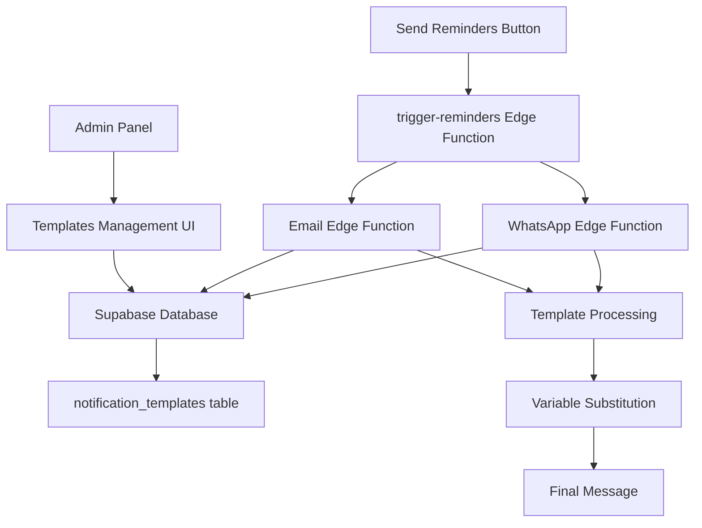

# Design Document

## Overview

O módulo de Gerenciamento de Templates de Notificação será implementado como uma extensão do painel administrativo existente, fornecendo uma interface completa para criação, edição e gerenciamento de templates de email e WhatsApp. O sistema utilizará uma arquitetura desacoplada onde o conteúdo das mensagens é armazenado no banco de dados e processado dinamicamente pelas Edge Functions.

## Architecture

### High-Level Architecture



### Database Schema

```sql
-- Tabela principal para templates
CREATE TABLE notification_templates (
    id UUID PRIMARY KEY DEFAULT gen_random_uuid(),
    name TEXT NOT NULL UNIQUE,
    type TEXT NOT NULL CHECK (type IN ('email', 'whatsapp')),
    subject TEXT, -- Obrigatório apenas para email
    content TEXT NOT NULL,
    is_active BOOLEAN DEFAULT true,
    created_at TIMESTAMP DEFAULT now(),
    updated_at TIMESTAMP DEFAULT now()
);

-- Políticas RLS
ALTER TABLE notification_templates ENABLE ROW LEVEL SECURITY;

CREATE POLICY "Admin can manage templates" ON notification_templates
    FOR ALL USING (auth.jwt() ->> 'email' LIKE '%@admin.enxergar');

-- Trigger para updated_at
CREATE OR REPLACE FUNCTION update_updated_at_column()
RETURNS TRIGGER AS $$
BEGIN
    NEW.updated_at = now();
    RETURN NEW;
END;
$$ language 'plpgsql';

CREATE TRIGGER update_notification_templates_updated_at 
    BEFORE UPDATE ON notification_templates 
    FOR EACH ROW EXECUTE FUNCTION update_updated_at_column();
```

### Component Architecture

```
src/
├── components/
│   └── admin/
│       ├── NotificationTemplatesCard.tsx
│       ├── TemplatesList.tsx
│       ├── TemplateForm.tsx
│       ├── TemplatePreview.tsx
│       └── VariablesHelper.tsx
├── hooks/
│   ├── useNotificationTemplates.ts
│   └── useTemplatePreview.ts
├── types/
│   └── notificationTemplates.ts
└── utils/
    └── templateProcessor.ts
```

## Components and Interfaces

### 1. NotificationTemplatesCard Component

**Localização:** `src/components/admin/NotificationTemplatesCard.tsx`

**Props Interface:**
```typescript
interface NotificationTemplatesCardProps {
  className?: string;
}
```

**Funcionalidades:**
- Card principal no dashboard administrativo
- Abas para Email e WhatsApp
- Botão "Novo Template"
- Lista de templates com ações (Editar, Duplicar, Excluir)
- Toggle para ativar/desativar templates

### 2. TemplateForm Component

**Localização:** `src/components/admin/TemplateForm.tsx`

**Props Interface:**
```typescript
interface TemplateFormProps {
  template?: NotificationTemplate;
  type: 'email' | 'whatsapp';
  onSave: (template: NotificationTemplateInput) => Promise<void>;
  onCancel: () => void;
  isLoading?: boolean;
}

interface NotificationTemplateInput {
  name: string;
  type: 'email' | 'whatsapp';
  subject?: string;
  content: string;
  is_active: boolean;
}
```

**Funcionalidades:**
- Formulário para criação/edição de templates
- Validação de campos obrigatórios
- Editor de texto com syntax highlighting para variáveis
- Preview em tempo real
- Helper de variáveis disponíveis

### 3. TemplatePreview Component

**Localização:** `src/components/admin/TemplatePreview.tsx`

**Props Interface:**
```typescript
interface TemplatePreviewProps {
  template: NotificationTemplateInput;
  sampleData?: TemplateSampleData;
}

interface TemplateSampleData {
  patient_name: string;
  event_title: string;
  event_date: string;
  event_time: string;
  event_location: string;
  event_address: string;
  confirmation_link?: string;
}
```

### 4. VariablesHelper Component

**Localização:** `src/components/admin/VariablesHelper.tsx`

**Props Interface:**
```typescript
interface VariablesHelperProps {
  type: 'email' | 'whatsapp';
  onVariableClick: (variable: string) => void;
}

interface TemplateVariable {
  key: string;
  description: string;
  example: string;
  required: boolean;
}
```

## Data Models

### NotificationTemplate Type

```typescript
export interface NotificationTemplate {
  id: string;
  name: string;
  type: 'email' | 'whatsapp';
  subject?: string;
  content: string;
  is_active: boolean;
  created_at: string;
  updated_at: string;
}

export interface NotificationTemplateInput {
  name: string;
  type: 'email' | 'whatsapp';
  subject?: string;
  content: string;
  is_active: boolean;
}

export interface TemplateVariable {
  key: string;
  description: string;
  example: string;
  required: boolean;
  type: 'patient' | 'event' | 'system';
}
```

### Available Variables

```typescript
export const EMAIL_VARIABLES: TemplateVariable[] = [
  {
    key: '{{patient_name}}',
    description: 'Nome completo do paciente',
    example: 'João Silva',
    required: false,
    type: 'patient'
  },
  {
    key: '{{patient_email}}',
    description: 'Email do paciente',
    example: 'joao@email.com',
    required: false,
    type: 'patient'
  },
  {
    key: '{{event_title}}',
    description: 'Título do evento',
    example: 'Atendimento Oftalmológico Gratuito',
    required: true,
    type: 'event'
  },
  {
    key: '{{event_date}}',
    description: 'Data do evento',
    example: '22/08/2025',
    required: true,
    type: 'event'
  },
  {
    key: '{{event_time}}',
    description: 'Horário do evento',
    example: '08:00 - 18:00',
    required: true,
    type: 'event'
  },
  {
    key: '{{event_location}}',
    description: 'Local do evento',
    example: 'Paróquia São José',
    required: true,
    type: 'event'
  },
  {
    key: '{{event_address}}',
    description: 'Endereço completo',
    example: 'Rua das Flores, 123 - Centro',
    required: true,
    type: 'event'
  },
  {
    key: '{{confirmation_link}}',
    description: 'Link para confirmação',
    example: 'https://enxergar.com.br/confirm/abc123',
    required: false,
    type: 'system'
  }
];

export const WHATSAPP_VARIABLES: TemplateVariable[] = [
  // Similar ao EMAIL_VARIABLES, mas sem confirmation_link
  // e com formatação específica para WhatsApp
];
```

## Error Handling

### Validation Rules

```typescript
export const templateValidationRules = {
  name: {
    required: true,
    minLength: 3,
    maxLength: 100,
    pattern: /^[a-zA-Z0-9_-]+$/,
    message: 'Nome deve conter apenas letras, números, _ e -'
  },
  subject: {
    required: (type: string) => type === 'email',
    maxLength: 200,
    message: 'Assunto é obrigatório para templates de email'
  },
  content: {
    required: true,
    minLength: 10,
    maxLength: 5000,
    message: 'Conteúdo deve ter entre 10 e 5000 caracteres'
  }
};
```

### Error Types

```typescript
export enum TemplateErrorType {
  VALIDATION_ERROR = 'validation_error',
  DUPLICATE_NAME = 'duplicate_name',
  TEMPLATE_NOT_FOUND = 'template_not_found',
  PERMISSION_DENIED = 'permission_denied',
  PROCESSING_ERROR = 'processing_error'
}

export interface TemplateError {
  type: TemplateErrorType;
  message: string;
  field?: string;
}
```

## Testing Strategy

### Unit Tests

1. **Template Processing**
   - Variable substitution accuracy
   - Error handling for invalid variables
   - Edge cases (empty content, missing variables)

2. **Form Validation**
   - Required field validation
   - Format validation (name pattern, content length)
   - Type-specific validation (subject for email)

3. **Component Behavior**
   - Template creation flow
   - Edit and update operations
   - Delete confirmation and execution

### Integration Tests

1. **Database Operations**
   - CRUD operations on notification_templates
   - RLS policy enforcement
   - Trigger functionality (updated_at)

2. **Edge Function Integration**
   - Template retrieval by name
   - Variable substitution in real scenarios
   - Error handling for missing templates

### E2E Tests

1. **Admin Workflow**
   - Complete template creation process
   - Template editing and preview
   - Template activation/deactivation

2. **Message Sending**
   - End-to-end message sending with custom templates
   - Variable substitution verification
   - Error scenarios (inactive templates, missing data)

## Security Considerations

### Access Control

1. **Row Level Security (RLS)**
   - Only admin users can access templates
   - Policy validation on all operations
   - Audit logging for template changes

2. **Input Validation**
   - Sanitization of template content
   - Prevention of script injection
   - Validation of variable syntax

3. **Edge Function Security**
   - Template access validation
   - Rate limiting for template processing
   - Error message sanitization

### Data Protection

1. **Template Content**
   - No sensitive data in templates
   - Variable validation before substitution
   - Secure storage of template data

2. **Variable Processing**
   - Validation of variable sources
   - Prevention of data leakage
   - Secure variable substitution

## Performance Considerations

### Caching Strategy

1. **Template Caching**
   - Cache active templates in Edge Functions
   - Invalidation on template updates
   - Fallback for cache misses

2. **Variable Processing**
   - Efficient regex for variable substitution
   - Batch processing for multiple messages
   - Optimization for large template content

### Database Optimization

1. **Indexing**
   - Index on name field for quick lookups
   - Index on type and is_active for filtering
   - Composite index for common queries

2. **Query Optimization**
   - Efficient queries for template retrieval
   - Pagination for template lists
   - Optimized joins for variable data

## Migration Strategy

### Database Migration

```sql
-- Migration script
-- File: supabase/migrations/20240101000000_create_notification_templates.sql

-- Create the table
CREATE TABLE notification_templates (
    id UUID PRIMARY KEY DEFAULT gen_random_uuid(),
    name TEXT NOT NULL UNIQUE,
    type TEXT NOT NULL CHECK (type IN ('email', 'whatsapp')),
    subject TEXT,
    content TEXT NOT NULL,
    is_active BOOLEAN DEFAULT true,
    created_at TIMESTAMP DEFAULT now(),
    updated_at TIMESTAMP DEFAULT now()
);

-- Enable RLS
ALTER TABLE notification_templates ENABLE ROW LEVEL SECURITY;

-- Create policies
CREATE POLICY "Admin can manage templates" ON notification_templates
    FOR ALL USING (auth.jwt() ->> 'email' LIKE '%@admin.enxergar');

-- Create trigger
CREATE OR REPLACE FUNCTION update_updated_at_column()
RETURNS TRIGGER AS $$
BEGIN
    NEW.updated_at = now();
    RETURN NEW;
END;
$$ language 'plpgsql';

CREATE TRIGGER update_notification_templates_updated_at 
    BEFORE UPDATE ON notification_templates 
    FOR EACH ROW EXECUTE FUNCTION update_updated_at_column();

-- Insert default templates
INSERT INTO notification_templates (name, type, subject, content) VALUES
('confirmacao_cadastro_email', 'email', 'Confirmação de Cadastro - {{event_title}}', 
'Olá {{patient_name}},

Sua inscrição para o evento "{{event_title}}" foi confirmada!

📅 Data: {{event_date}}
⏰ Horário: {{event_time}}
📍 Local: {{event_location}}
🏠 Endereço: {{event_address}}

Por favor, chegue com 30 minutos de antecedência.

Atenciosamente,
Equipe Enxergar sem Fronteiras'),

('lembrete_whatsapp_48h', 'whatsapp', NULL,
'🔔 *Lembrete Importante*

Olá {{patient_name}}! 

Lembramos que você tem um atendimento agendado:

📅 *{{event_date}}* às *{{event_time}}*
📍 {{event_location}}
🏠 {{event_address}}

⚠️ Chegue com 30 minutos de antecedência
📋 Traga um documento com foto

_Enxergar sem Fronteiras_ 👁️');
```

### Code Integration

1. **Phase 1: Database Setup**
   - Run migration script
   - Verify RLS policies
   - Test basic CRUD operations

2. **Phase 2: Frontend Components**
   - Implement base components
   - Add to admin dashboard
   - Test template management

3. **Phase 3: Edge Function Integration**
   - Update existing Edge Functions
   - Implement template processing
   - Test message sending

4. **Phase 4: Testing and Deployment**
   - Comprehensive testing
   - Performance validation
   - Production deployment