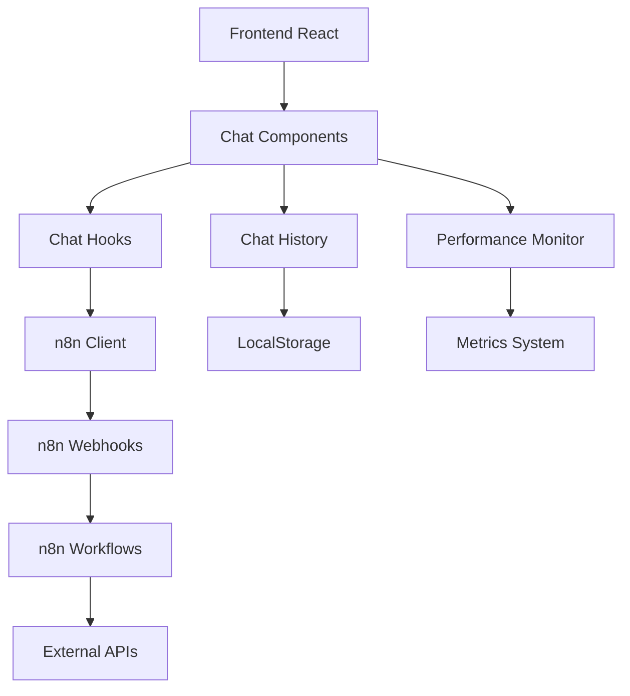

# Sistema de Chat com Integração n8n

## Visão Geral

O sistema de chat oferece uma solução completa para comunicação em tempo real integrada com workflows n8n. Suporta tanto chat público para captação de leads quanto chat administrativo para suporte interno.

## Arquitetura



## Componentes Principais

### 1. ChatInterface
Componente principal que orquestra toda a funcionalidade de chat.

```tsx
import { ChatInterface } from '@/components/chat';

<ChatInterface
  type="public" // ou "admin"
  webhookUrl="https://your-n8n.com/webhook/chat"
  placeholder="Digite sua mensagem..."
  maxHeight={400}
  enableVoice={true}
  onSessionStart={(sessionId) => console.log('Sessão iniciada:', sessionId)}
  onSessionEnd={(sessionId) => console.log('Sessão finalizada:', sessionId)}
  onError={(error) => console.error('Erro no chat:', error)}
  onMetrics={(event, data) => console.log('Métrica:', event, data)}
  theme="light" // ou "dark"
/>
```

### 2. PublicChatWidget
Widget flutuante para páginas públicas.

```tsx
import { PublicChatWidget } from '@/components/chat';

<PublicChatWidget
  webhookUrl="https://your-n8n.com/webhook/public-chat"
  position="bottom-right"
  theme="light"
  enableVoice={false}
  autoOpen={false}
  welcomeMessage="Olá! Como posso ajudar?"
/>
```

### 3. AdminChatPanel
Painel de chat para área administrativa.

```tsx
import { AdminChatPanel } from '@/components/chat';

<AdminChatPanel
  webhookUrl="https://your-n8n.com/webhook/admin-chat"
  userId={currentUser.id}
  enableMultipleSessions={true}
  showMetrics={true}
/>
```

## Hooks Disponíveis

### useChatHistory
Gerencia o histórico de conversas.

```tsx
import { useChatHistory } from '@/hooks/useChatHistory';

const MyComponent = () => {
  const chatHistory = useChatHistory();

  // Criar nova sessão
  const sessionId = chatHistory.createSession('public', webhookUrl);

  // Adicionar mensagem
  const messageId = chatHistory.addMessage(
    sessionId,
    'Olá!',
    'user'
  );

  // Obter sessão
  const session = chatHistory.getSession(sessionId);

  // Listar todas as sessões
  const sessions = chatHistory.getAllSessions();

  return <div>...</div>;
};
```

### useN8nChat
Gerencia comunicação com n8n.

```tsx
import { useN8nChat } from '@/hooks/useN8nChat';

const MyComponent = () => {
  const n8nChat = useN8nChat({
    publicWebhookUrl: 'https://your-n8n.com/webhook/public',
    adminWebhookUrl: 'https://your-n8n.com/webhook/admin',
    apiKey: 'your-api-key'
  });

  // Enviar mensagem
  const handleSend = async () => {
    const response = await n8nChat.sendMessage(
      'session-id',
      'Mensagem do usuário',
      'public'
    );

    console.log('Resposta:', response.data);
  };

  // Estados disponíveis
  const { isLoading, error, lastResponse } = n8nChat.state;

  return <div>...</div>;
};
```

### useChatConfig
Gerencia configurações do chat.

```tsx
import { useChatConfig } from '@/hooks/useChatConfig';

const MyComponent = () => {
  const { config, updateConfig, resetConfig } = useChatConfig();

  // Atualizar configuração
  const handleUpdate = () => {
    updateConfig({
      enableVoiceInput: true,
      maxMessageLength: 1000,
      enableMetrics: true
    });
  };

  return <div>...</div>;
};
```

### useChatPerformance
Monitora performance do chat.

```tsx
import { useChatPerformance } from '@/hooks/useChatPerformance';

const MyComponent = () => {
  const {
    metrics,
    isHealthy,
    alerts,
    forceCleanup,
    getOptimizationRecommendations
  } = useChatPerformance({
    autoInitialize: true,
    trackMetrics: true,
    thresholds: {
      memoryUsage: 100, // MB
      minFPS: 30,
      maxLatency: 1000 // ms
    }
  });

  return (
    <div>
      <p>Memória: {metrics.memoryUsage.used / (1024 * 1024)} MB</p>
      <p>FPS: {metrics.averageFPS}</p>
      <p>Status: {isHealthy ? 'Saudável' : 'Problemas'}</p>
      {alerts.length > 0 && (
        <div>Alertas: {alerts.length}</div>
      )}
    </div>
  );
};
```

## Configuração

### Variáveis de Ambiente

```env
# URLs dos webhooks n8n
VITE_N8N_PUBLIC_WEBHOOK_URL=https://your-n8n.com/webhook/public-chat
VITE_N8N_ADMIN_WEBHOOK_URL=https://your-n8n.com/webhook/admin-chat

# API Key do n8n (opcional)
VITE_N8N_API_KEY=your-api-key

# Configurações de chat
VITE_CHAT_ENABLE_VOICE=true
VITE_CHAT_ENABLE_METRICS=true
VITE_CHAT_MAX_MESSAGE_LENGTH=1000
VITE_CHAT_SESSION_TIMEOUT=1800000
VITE_CHAT_ENABLE_PERSISTENCE=true
```

### Feature Flags

```tsx
import { getChatConfig, updateChatConfig } from '@/lib/chat/chatConfig';

// Obter configuração atual
const config = getChatConfig();

// Atualizar configuração
updateChatConfig({
  enableChat: true,
  enablePublicChat: true,
  enableAdminChat: true,
  enableVoiceInput: false,
  enableMetrics: true,
  enableDevMode: false,
  enableNotifications: true,
  maxMessageLength: 1000,
  sessionTimeout: 30 * 60 * 1000, // 30 minutos
  enablePersistence: true,
  enableAutoCleanup: true,
  cleanupInterval: 24 * 60 * 60 * 1000 // 24 horas
});
```

## Integração com n8n

### Estrutura do Webhook

O sistema espera que os webhooks n8n respondam com a seguinte estrutura:

```json
{
  "success": true,
  "data": {
    "response": "Resposta do agente",
    "sessionId": "session-123",
    "actions": [
      {
        "type": "redirect",
        "url": "/contact"
      }
    ],
    "sessionComplete": false,
    "metadata": {
      "sentiment": "positive",
      "confidence": 0.95
    }
  },
  "error": null
}
```

### Exemplo de Workflow n8n

```json
{
  "nodes": [
    {
      "name": "Webhook",
      "type": "n8n-nodes-base.webhook",
      "parameters": {
        "path": "chat",
        "httpMethod": "POST"
      }
    },
    {
      "name": "Process Message",
      "type": "n8n-nodes-base.function",
      "parameters": {
        "functionCode": "// Processar mensagem do usuário\nconst userMessage = $json.message;\nconst sessionId = $json.sessionId;\nconst chatType = $json.type;\n\n// Lógica de processamento\nlet response = 'Obrigado pela sua mensagem!';\n\nif (userMessage.toLowerCase().includes('preço')) {\n  response = 'Nossos preços começam em R$ 99/mês. Gostaria de mais detalhes?';\n}\n\nreturn {\n  success: true,\n  data: {\n    response,\n    sessionId,\n    sessionComplete: false\n  }\n};"
      }
    }
  ]
}
```

## Exemplos de Uso

### 1. Chat Público Simples

```tsx
import React from 'react';
import { PublicChatWidget } from '@/components/chat';

const LandingPage = () => {
  return (
    <div>
      <h1>Bem-vindo ao nosso site!</h1>
      <p>Conteúdo da página...</p>

      <PublicChatWidget
        webhookUrl={process.env.VITE_N8N_PUBLIC_WEBHOOK_URL}
        welcomeMessage="Olá! Como posso ajudar você hoje?"
        position="bottom-right"
        theme="light"
      />
    </div>
  );
};

export default LandingPage;
```

### 2. Chat Administrativo

```tsx
import React from 'react';
import { AdminChatPanel } from '@/components/chat';
import { useAuth } from '@/hooks/useAuth';

const AdminDashboard = () => {
  const { user } = useAuth();

  return (
    <div className="admin-layout">
      <aside>
        <AdminChatPanel
          webhookUrl={process.env.VITE_N8N_ADMIN_WEBHOOK_URL}
          userId={user.id}
          enableMultipleSessions={true}
          showMetrics={true}
        />
      </aside>
      <main>
        {/* Conteúdo principal */}
      </main>
    </div>
  );
};

export default AdminDashboard;
```

### 3. Chat Customizado

```tsx
import React, { useState } from 'react';
import { ChatInterface } from '@/components/chat';
import { useChatHistory, useN8nChat } from '@/hooks';

const CustomChat = () => {
  const [sessionId, setSessionId] = useState<string | null>(null);
  const chatHistory = useChatHistory();
  const n8nChat = useN8nChat({
    publicWebhookUrl: process.env.VITE_N8N_PUBLIC_WEBHOOK_URL!
  });

  const handleSessionStart = (newSessionId: string) => {
    setSessionId(newSessionId);
    console.log('Nova sessão iniciada:', newSessionId);
  };

  const handleError = (error: any) => {
    console.error('Erro no chat:', error);
    // Implementar tratamento customizado
  };

  const handleMetrics = (event: string, data: any) => {
    console.log('Métrica capturada:', event, data);
    // Enviar para analytics
  };

  return (
    <div className="custom-chat-container">
      <ChatInterface
        type="public"
        webhookUrl={process.env.VITE_N8N_PUBLIC_WEBHOOK_URL!}
        placeholder="Digite sua mensagem..."
        maxHeight={500}
        enableVoice={true}
        onSessionStart={handleSessionStart}
        onError={handleError}
        onMetrics={handleMetrics}
        theme="dark"
      />

      {sessionId && (
        <div className="chat-info">
          <p>Sessão ativa: {sessionId}</p>
          <p>Mensagens: {chatHistory.getSession(sessionId)?.messages.length || 0}</p>
        </div>
      )}
    </div>
  );
};

export default CustomChat;
```

### 4. Chat com Entrada de Voz

```tsx
import React from 'react';
import { ChatInterface, VoiceInput } from '@/components/chat';

const VoiceEnabledChat = () => {
  return (
    <div>
      <ChatInterface
        type="public"
        webhookUrl={process.env.VITE_N8N_PUBLIC_WEBHOOK_URL!}
        enableVoice={true}
        placeholder="Digite ou fale sua mensagem..."
      />

      {/* Ou usar componente de voz separadamente */}
      <VoiceInput
        onTranscription={(text) => console.log('Texto transcrito:', text)}
        onError={(error) => console.error('Erro de voz:', error)}
        language="pt-BR"
      />
    </div>
  );
};

export default VoiceEnabledChat;
```

## Monitoramento e Métricas

### Dashboard de Métricas

```tsx
import React from 'react';
import { ChatMetricsDashboard } from '@/components/chat';

const MetricsDashboard = () => {
  return (
    <div>
      <h1>Métricas do Chat</h1>
      <ChatMetricsDashboard
        showRealTime={true}
        showHistorical={true}
        timeRange="24h"
        refreshInterval={30000}
      />
    </div>
  );
};

export default MetricsDashboard;
```

### Monitor de Performance

```tsx
import React from 'react';
import { ChatPerformanceMonitor } from '@/components/chat';

const App = () => {
  return (
    <div>
      {/* Sua aplicação */}

      {/* Monitor de performance (apenas em desenvolvimento) */}
      <ChatPerformanceMonitor
        showDetailed={true}
        showAlerts={true}
        showAutoOptimization={true}
        position="bottom-left"
        devModeOnly={true}
      />
    </div>
  );
};

export default App;
```

## Testes

### Testes Unitários

```tsx
import { render, screen, fireEvent, waitFor } from '@testing-library/react';
import { ChatInterface } from '@/components/chat';

describe('ChatInterface', () => {
  it('should send message when form is submitted', async () => {
    const mockWebhookUrl = 'https://test.com/webhook';
    const onSessionStart = jest.fn();

    render(
      <ChatInterface
        type="public"
        webhookUrl={mockWebhookUrl}
        onSessionStart={onSessionStart}
      />
    );

    const input = screen.getByPlaceholderText(/digite sua mensagem/i);
    const button = screen.getByRole('button', { name: /enviar/i });

    fireEvent.change(input, { target: { value: 'Olá!' } });
    fireEvent.click(button);

    await waitFor(() => {
      expect(onSessionStart).toHaveBeenCalled();
    });
  });
});
```

### Testes de Integração

```tsx
import { renderHook, act } from '@testing-library/react';
import { useN8nChat } from '@/hooks/useN8nChat';

describe('useN8nChat Integration', () => {
  it('should send message to n8n webhook', async () => {
    const { result } = renderHook(() => useN8nChat({
      publicWebhookUrl: 'https://test.com/webhook'
    }));

    await act(async () => {
      const response = await result.current.sendMessage(
        'test-session',
        'Test message',
        'public'
      );

      expect(response.success).toBe(true);
    });
  });
});
```

## Troubleshooting

### Problemas Comuns

1. **Chat não carrega**
   - Verificar se as variáveis de ambiente estão configuradas
   - Confirmar se o webhook n8n está ativo
   - Verificar console do browser para erros

2. **Mensagens não são enviadas**
   - Verificar URL do webhook
   - Confirmar se n8n está respondendo corretamente
   - Verificar logs de rede no DevTools

3. **Performance ruim**
   - Ativar monitor de performance em desenvolvimento
   - Verificar uso de memória
   - Considerar ativar virtualização para conversas longas

4. **Entrada de voz não funciona**
   - Verificar permissões do microfone
   - Confirmar suporte do browser à Web Speech API
   - Testar em HTTPS (necessário para microfone)

### Debug

```tsx
import { getChatConfig, updateChatConfig } from '@/lib/chat/chatConfig';

// Ativar modo debug
updateChatConfig({
  enableDevMode: true,
  enableMetrics: true
});

// Verificar logs no console
console.log('Configuração do chat:', getChatConfig());
```

### useOfflineChat
Gerencia funcionalidade offline e fallbacks.

```tsx
import { useOfflineChat } from '@/hooks/useOfflineChat';

const MyComponent = () => {
  const offlineChat = useOfflineChat({
    fallbackResponses: {
      greeting: "Olá! No momento estou offline, mas sua mensagem foi salva.",
      general: "Desculpe, estou temporariamente offline. Sua mensagem foi registrada.",
      error: "Não foi possível conectar ao servidor. Suas mensagens estão sendo salvas."
    },
    enableSmartResponses: true,
    syncOnReconnect: true,
    onSync: async (pendingMessages) => {
      // Sincronizar mensagens pendentes
      for (const message of pendingMessages) {
        await sendToServer(message);
      }
      return { success: true };
    }
  });

  // Estados disponíveis
  const {
    isOnline,
    pendingMessages,
    syncStatus,
    handleOfflineMessage,
    clearPendingMessages,
    removePendingMessage
  } = offlineChat;

  return (
    <div>
      <p>Status: {isOnline ? 'Online' : 'Offline'}</p>
      <p>Mensagens pendentes: {pendingMessages.length}</p>
      <p>Sincronização: {syncStatus}</p>
    </div>
  );
};
```

## Roadmap

### Funcionalidades Implementadas ✅

- [x] Sistema de chat completo
- [x] Integração com n8n
- [x] Entrada por voz
- [x] Métricas e performance
- [x] Testes abrangentes
- [x] Modo offline com sincronização
- [x] Fallbacks inteligentes
- [x] Persistência local

### Próximas Funcionalidades

- [ ] Suporte a anexos de arquivo
- [ ] Chat em grupo
- [ ] Integração com WhatsApp
- [ ] Chatbots com IA
- [ ] Análise de sentimento em tempo real
- [ ] Tradução automática

### Melhorias Planejadas

- [ ] Otimização de bundle size
- [ ] Suporte a PWA
- [ ] Temas customizáveis
- [ ] Plugins de terceiros
- [ ] API REST para integração externa

## Contribuição

Para contribuir com o sistema de chat:

1. Fork o repositório
2. Crie uma branch para sua feature
3. Implemente os testes
4. Faça commit das mudanças
5. Abra um Pull Request

### Padrões de Código

- Use TypeScript para type safety
- Siga os padrões ESLint configurados
- Adicione testes para novas funcionalidades
- Documente APIs públicas
- Use conventional commits

## Licença

Este sistema é parte do projeto interno e segue as políticas de licenciamento da empresa.
